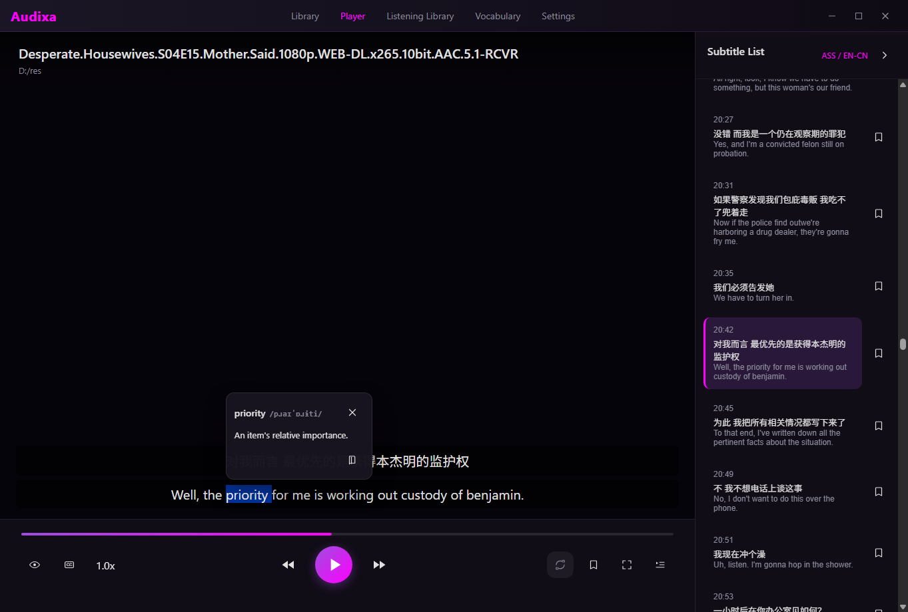
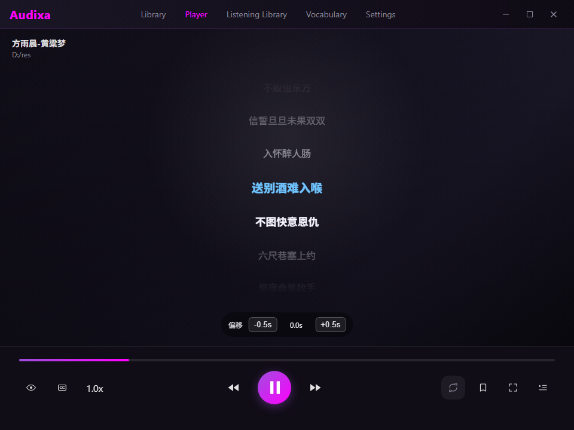
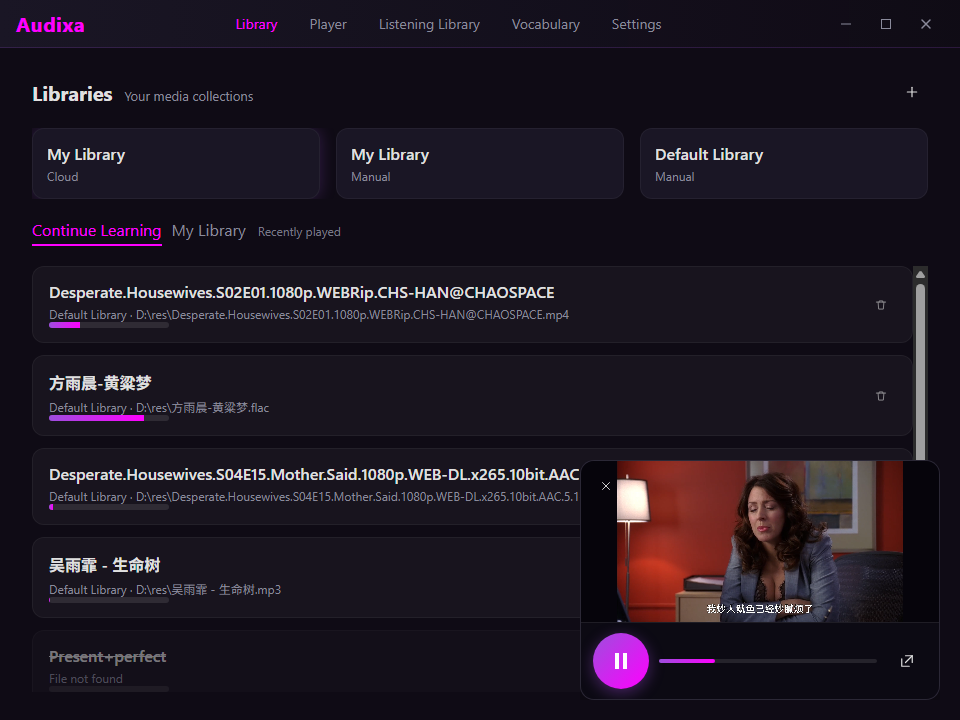
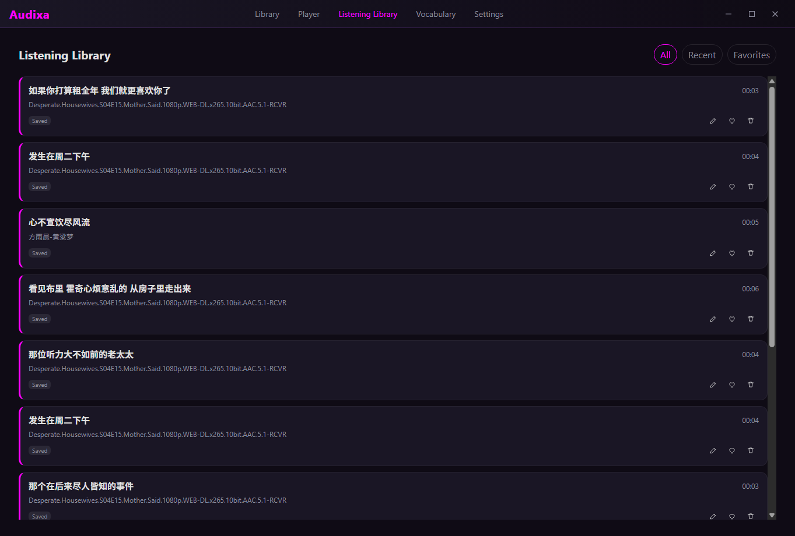
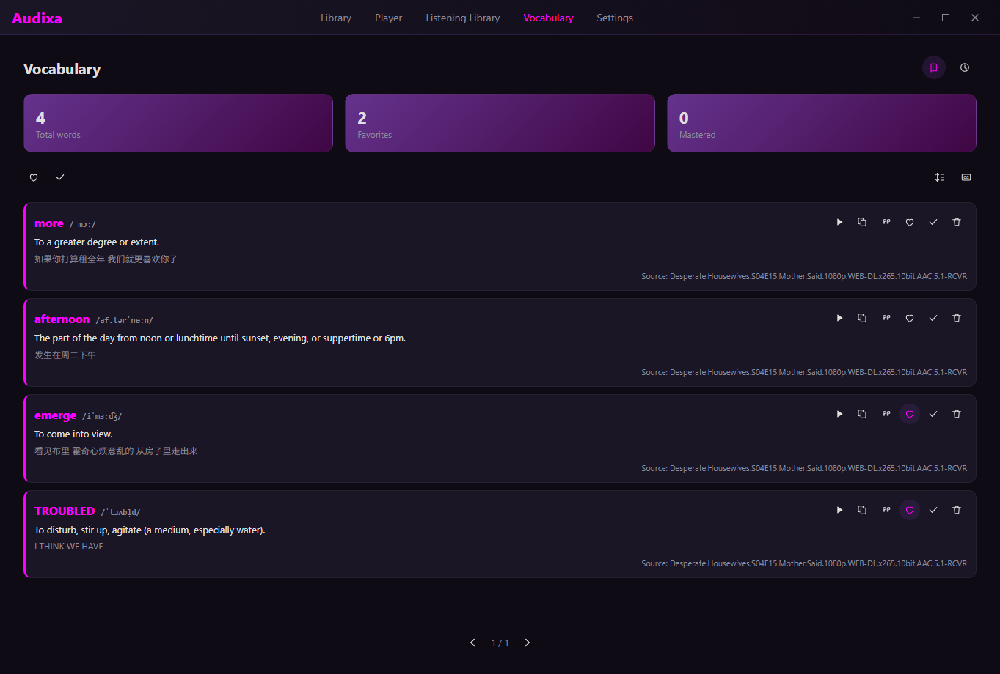

# Audixa

> Subtitle-Driven Language Learning Player

**Turn any video into your language learning classroom.**

Audixa is an innovative audio/video player that treats **subtitle sentences as first-class citizens**, enabling efficient language learning through movies, TV shows, documentaries, and more.

## Screenshots

<p align="center">
  
  <br/>
  <em>Player: Click subtitles to seek, A/B loop, mask for listening challenges</em>
</p>

<p align="center">
  
  <br/>
  <em>Audio: Practice listening with subtitles as interactive sentences</em>
</p>

<p align="center">
  
  <br/>
  <em>Media Library: Manage local files, NAS, and cloud sources</em>
</p>

<p align="center">
  
  <br/>
  <em>Listening Library: Save and replay favorite sentences</em>
</p>

<p align="center">
  
  <br/>
  <em>Vocabulary: Tap words to lookup, build your word collection</em>
</p>

## What Makes Audixa Different

Unlike regular players, Audixa transforms every subtitle sentence into an interactive, trackable learning unit:

- **Click to Seek** — Tap any subtitle to jump instantly
- **Loop to Repeat** — One-click A/B loop for intensive listening
- **Mask to Challenge** — Hide subtitles to test your listening
- **Track to Improve** — Quantify your learning behavior

## Core Features

### 🎯 Sentence-Level Control

- Click any subtitle sentence to seek precisely
- A/B loop with automatic sentence boundary detection
- Subtitle masking/blur for listening challenges
- Dual-language subtitle display

### 📚 Listening Library

- Save favorite sentences with one tap
- Replay audio segments independently
- Build your personal listening materials

### 📖 Vocabulary Book

- Tap any word for instant lookup
- Add words to vocabulary list
- Context-aware word collection

### 📊 Learning Statistics

- Track play/loop counts per sentence
- Monitor learning time
- Visualize progress

### 🌐 Cross-Platform

- **Desktop**: Windows, macOS
- **Mobile**: iOS, Android (coming soon)
- Local-first data storage

## Supported Media Sources

| Source | Status |
|--------|--------|
| Local Files | ✅ Supported |
| Local Folder Monitoring | ✅ Supported |
| NAS / WebDAV | ✅ Supported |
| Cloud Storage | 🔜 Planned |

## Supported Subtitle Formats

- SRT (most common)
- VTT (web standard)
- ASS/SSA (styled subtitles)

## Installation

Download the latest release for your platform from [Releases](https://github.com/AGIBuild/Audixa/releases).

### macOS

> **Note**: The app is not notarized yet. macOS may show "Audixa is damaged and can't be opened."

**Fix**: Open Terminal and run:

```bash
xattr -cr /Applications/Audixa.app
```

Then reopen the app.

### Windows

Run the `.exe` or `.msi` installer directly.

### Linux

Use `.deb` (Debian/Ubuntu), `.rpm` (Fedora/RHEL), or `.AppImage` (universal).

## Quick Start

1. **Install** — Download for your platform (see above)
2. **Import** — Add video/audio files to library
3. **Load Subtitles** — Auto-detect or search online
4. **Learn** — Click, loop, mask, and master

## Technical Highlights

- **Millisecond Precision**: Seek < 250ms, loop boundary ± 40ms
- **Native Playback**: mpv (Desktop), AVPlayer (iOS), ExoPlayer (Android)
- **Cross-Platform UI**: React / React Native with shared components
- **Local-First**: SQLite storage, no network required

## Who Is Audixa For

- 🎬 **Movie & TV fans** learning through entertainment
- 🎓 **Language learners** improving listening skills
- 📺 **Documentary enthusiasts** learning domain vocabulary
- 🎵 **Podcast listeners** extracting key content

## Documentation

- [Product Overview](docs/product/index.md)
- [Getting Started](docs/product/getting-started.md)
- [Platform Support](docs/product/platforms.md)
- Features:
  - [Subtitle Control](docs/product/features/subtitle-control.md)
  - [Media Library](docs/product/features/media-library.md)
  - [Listening Library](docs/product/features/listening-library.md)
  - [Vocabulary](docs/product/features/vocabulary.md)
  - [Learning Stats](docs/product/features/learning-stats.md)

## Privacy

- All learning data stored locally by default
- No data leaves your device without explicit consent
- Optional cloud sync (planned) with user control

---

*Audixa: Make every viewing a learning experience.*
